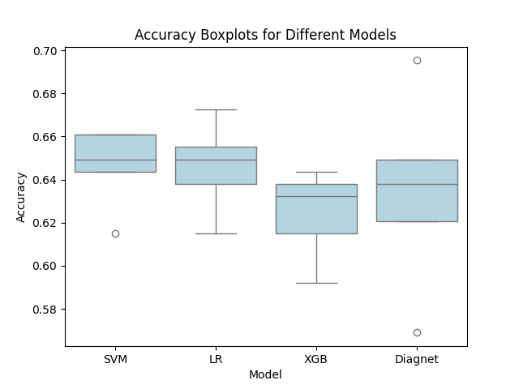
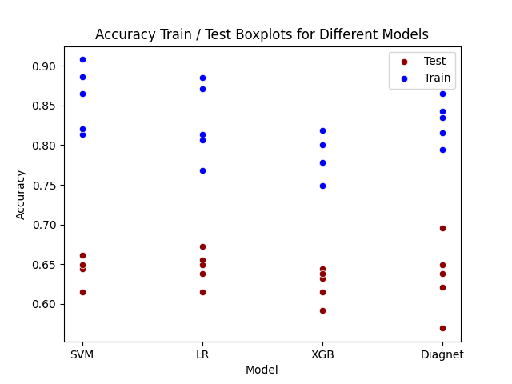
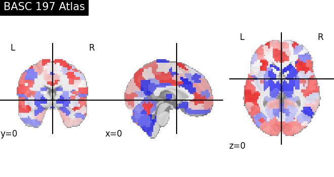
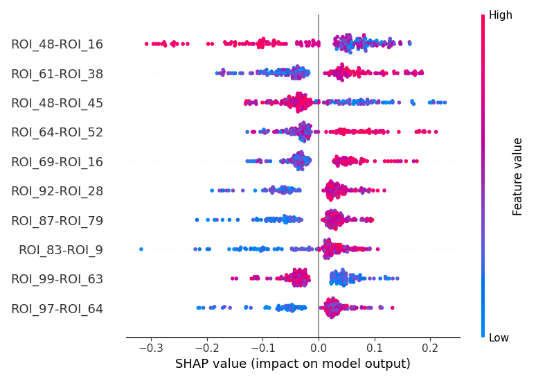
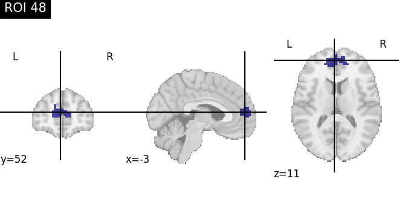
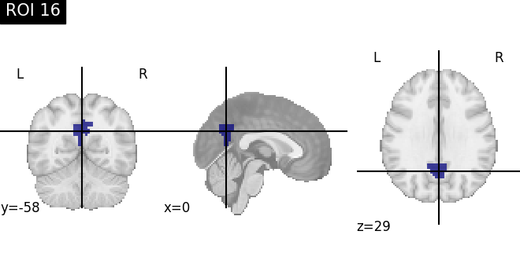

# Post-analysis
--------------

## Results
Firstly, we splitted the data (with 870 samples) with 5 Stratified folds, calculated the ANOVA F-score, taking the top 5000 features (from 19503), and did Recursive Feature Elimination. The number of features for each split was:

| Split | Number of features |
| - | - |
| 1 | 255 |
| 2 | 583 |
| 3 | 1227 |
| 4 | 710 |
| 5 | 1039 |

It should be noted that in most splits the number of features is reasonable compared to the number of samples, which intends to avoid the curse of dimensionality.

After having performed nested cross-validation for each model, as described in pre.md, the mean values across splits for each metric were the following: 

| Model               | Accuracy | Accuracy Train | Precision | Recall | ROC AUC |
|---------------------|----------|----------------|-----------|--------|---------|
| ASD-DiagNet         | 0.6345   | 0.8305         | 0.6655    | 0.6600 | 0.6370  |
| SVM                 | 0.6460   | 0.8586         | 0.6456    | 0.5969 | 0.6425  |
| Logistic Regression | 0.6460   | 0.8287         | 0.6451    | 0.5722 | 0.6408  |
| XGBoost             | 0.6241   | 0.7848         | 0.6224    | 0.5298 | 0.6175  |

\
We decided to select XGBoost as the best model because, despite not having the best accuracy, the gap between the test accuracy and train accuracy is smaller, which means it is the one less likely to overfit. To see if the accuracy was stable across splits, we can observe the following graph:

It appears that the XGBoost was stable, contrary to ASD-DiagNet which had two outliers. This is likely due to the fact that nested CV was not used, only simple CV, since we decided to keep the hyperparameters from the original paper. As well as that, a different feature selection method was used for this particular model.

We can also see how overfitting there was for each model, comparing training and test accuracy:

In the previous figure, we can see more clearly that the XGBoost model had less overfitting compared to the rest.

After selecting the XGBoost model as the best one, we looked at the best hyperparameters for each split: 
| Split | colsample_bytree | max_depth | subsample   |
|-------|-------|--------|---------|
| 1     | 0.7   | 5      | 0.5   | 
| 2     | 0.5   | 5      | 0.6    | 
| 3     | 0.6  | 5      | 0.5  | 
| 4     | 0.7   | 5      | 0.5     | 
| 5     | 0.7   | 5      | 0.6     | 

It seems colsample_bytree = 0.7, subsample = 0.5 and max_depth = 5 are the optimal parameters. On the other hand, we selected features by ANOVA and RFE of the fourth split, since it was the split with the best accuracy out of the five, with a total of 710 features. 

With this XGBoost model, we used the whole dataset for training and achieved a training accuracy of 80%, which is reasonable compared to the previous error estimations. Then, this fitted model was used to calculate the SHAP values, indicating which were the most significant features.

Remember the atlas that was used (Bootstrap Analysis of Stable Clusters with 197 Regions Of Interest) did not have nominal names, so they are just identified by numbers and by their coordinates.

In the following plot, we can see the most important correlations between ROIs:

(Note: class 0 was control and class 1 was for ASD, so the positive SHAP values tells us the correlation helped us identify ASD and the negative values, the TD)

A higher correlation between ROIs 48 and 16 indicated the sample was more likely to belong to controls (the mean correlation value across all samples was 0.5243 for TD and 0.4746 for ASD).

Afterwards, we extracted the coordinates from the main ROIs:
| ROI | Coordinates |
| - | - |
|48 | [-9.10 52.01 12.51] |
|16| [ -5.55   -57.7     28.1125] |
|61| [ 22.39  -71. -30.29] |
|38| [-56.01  -4.74  10.        ] |
|45| [ 50.69   6.8  -30.75] |
|64| [-25.76  19.13  52.91] |
|69| [43.92 25.06 21.12] |

\
Lastly, we plotted the regions 48 and 16:

## Conclusion
This study offers a methodology for evaluating and comparing machine learning models for ASD and TD classification, using functional connectivity from rs-fMRI, with different feature selection methods, and intentds to interpret the resulting models with Shapley Additive Explanations.

Firstly, the expected 82% accuracy for ASD-DiagNet model was not achieved, only a mean accuracy of 63.45%, which could be a sign of overfitting in the original paper. 

On the other hand, the best model in our study was XGBoost, with a mean accuracy of 62.41%, and we achieved 64.6% accuracy with a kernel SVM. Despite the fact that this result is far from 82%, it is closer to the performance of other works which used most samples from the ABIDE dataset and only fMRI data (Xin Yang et al.$^{(1)}$ achieved 69% accuracy with a kernel SVM). As well as that, the best estimator of the XGBoost model only needed 710 features out of 19503, due to the feature selection with ANOVA and RFE, which made the training much faster and less prone to overfitting. 

With the best model fitted to the entire dataset and the SHAP method, we were able to see which brain connections were more relevant for the classification model, which may serve as functional biomarkers for the diagnosis of ASD.

However, it should be highlighted that a model with this performance is still not promising for clinical use. The main problem is that in order to train machine learning models with a very high number of features, it is generally necessary to have a large number of samples (especially if we were to explore other deeper Neural Networks models). Apart from the lack of data, the ABIDE dataset is multi-site, which makes it even harder for the model, and even autism itself is heterogeneous, meaning different types of ASD patients could present different brain functional connectivity.

There are still a number of options to be explored: the gathering of more data of ASD patients, data augmentation methods, the discovery of newer and more optimal methods and ML models, using dynamic functional connectivity instead of the traditional static FC, combining fMRI data with other kind of data (like demographic or anatomic data). All of this could potentially lead to better results in the future and hopefully contribute to the diagnosis and a greater understanding of autism.

\
(1) Xin Yang, Ning Zhang, Paul Schrader, “A study of brain networks for autism spectrum disorder classification using resting-state functional connectivity”, Machine Learning with Applications, Volume 8, 2022.