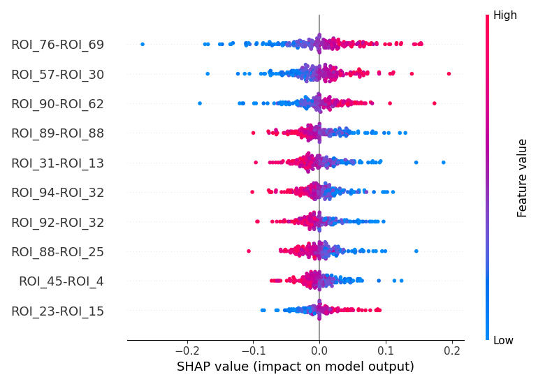

# Post-analysis
--------------

## Results
Firstly, we splitted the data (with 870 simples) with 5 Stratified folds, calculated the ANOVA F-score, taking the top 5000 features (from 19503), and did Recursive Feature Elimination. The number of features for each split was:

| Split | Number of features |
| - | - |
| 1 | 392 |
| 2 | 122 |
| 3 | 671 |
| 4 | 200 |
| 5 | 252 |

It should be noted that in every split the number of features is lower than the number of samples, which intends to avoid the curse of dimensionality.

After having performed nested cross-validation for each model, as described in pre.md, the mean values across splits for each metric were the following: 

| Model               | Accuracy | Precision | Recall | ROC AUC |
|---------------------|----------|-----------|--------|---------|
| ASD-DiagNet         | 0.6345   | 0.6655    | 0.6600 | 0.6370  |
| SVM                 | 0.6540   | 0.6550    | 0.6072 | 0.6508  |
| Logistic Regression | 0.6494   | 0.6490    | 0.5698 | 0.6438  |
| XGBoost             | 0.5920   | 0.5910    | 0.5348 | 0.5879  |

\
The model with the best overall metrics was SVM, although ASD-DiagNet and Logistic Regression had a similar performance. To see if the accuracy was stable across splits, we can observe the following graph:

It appears that the SVM was also the most stable model, contrary to ASD-DiagNet which had two outliers (likely due to the fact that nested CV was not used, only simple CV, since we decided to keep the hyperparameters from the original paper).

After selecting the SVM model as the best one, we looked at the best hyperparameters for each split: 
| Split | C     | Degree | Gamma   | Kernel   |
|-------|-------|--------|---------|----------|
| 1     | 100   | 3      | 0.001   | sigmoid  |
| 2     | 10    | 3      | 0.01    | rbf      |
| 3     | 1000  | 3      | 0.0001  | rbf      |
| 4     | 1     | 3      | 0.1     | rbf      |
| 5     | 0.1   | 3      | 0.1     | poly     |

It seems the Radial Basis Function kernel is preferable over the rest, the optimal value for gamma is 0.01, and we select C = 1 because this was the split with the best accuracy out of the five. For the same reason, we used the selected features by ANOVA and RFE of the fourth split, with a total of 200 features.

With this SVM model, we used the whole dataset for training and achieved a training accuracy of 69.92%, which is reasonable compared to the previous error estimations. Then, this fitted model was used to calculate the SHAP values, indicating which were the most significant features.

Remember the atlas that was used (Bootstrap Analysis of Stable Clusters with 197 Regions Of Interest) did not have nominal names, so they are just identified by numbers and by their coordinates.

In the following plot, we can see the most important correlations between ROIs:

(Note: class 0 was control and class 1 was for ASD, so the positive SHAP values tells us the correlation helped us identify ASD and the negative values, the TD)

A higher correlation between ROIs 76 and 69 indicated the sample was more likely to belong to ASD (the mean correlation value across all samples was 0.2596 for TD and 0.2965 for ASD).

Afterwards, we extracted the coordinates from the main ROIs:
| ROI | Coordinates |
| - | - |
|76 | [-7,         49.6, 45.5       ] |
|69 | [43.9, 25.1, 21.1] |
|57 | [-45.9, -45.3, 48] |
|30 | [ -5.2, -44.6,  22.9 ] |
|90 | [-41.5, -34.2,  44.7] |
|62 | [-10.2, -44.7,  36.4] |

Lastly, we plotted the regions 76 and 69:

## Conclusion
In the first place, the expected 82% accuracy for ASD-DiagNet model was not achieved, only a mean accuracy of 63.45%, which could be a sign of overfitting in the original paper.

The best model in our study was kernel SVM, with a mean accuracy of 65.4%. Despite the fact that this result is far from 82% and 
However, this performance is still not promising enough for a future clinical use 